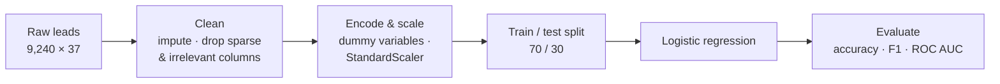
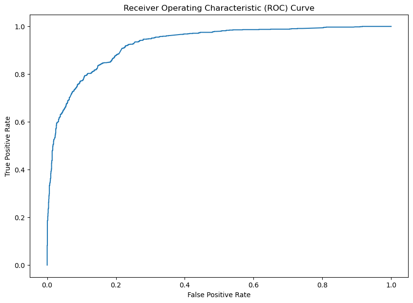
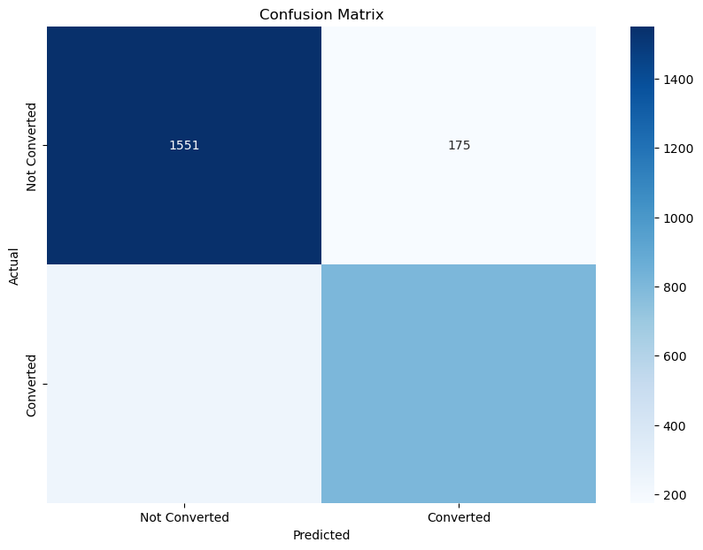

# 🎯 Lead Scoring: Predicting Lead Conversion


A logistic regression model that scores **9,240 sales leads** for an online education company by how likely they are to convert, so the sales team can focus on the leads most likely to become paying customers.

---

## 📌 Business Problem

X Education gets many leads but converts only about 38% of them. Calling every lead wastes the sales team's time. The company wants a **lead score** for each prospect so that effort goes to "hot" leads first.

## 🔄 Approach



- **Missing values:** mode for categorical columns, median for numerical ones, and "Unknown" for `Lead Quality`
- **Feature selection:** dropped IDs and columns with excessive missing data (`Tags`, `Asymmetrique` scores), guided by the data dictionary
- **Encoding:** one-hot dummy variables with the first category dropped to avoid multicollinearity
- **Scaling:** standardised the continuous features so each contributes fairly

## 📊 Results

| Metric | Score |
|---|---|
| Accuracy | **85.1%** |
| Precision | 82.2% |
| Recall | 77.2% |
| F1 score | 0.80 |
| ROC AUC | **0.93** |

<table>
<tr>
<td width="50%"><br><sub><b>ROC curve</b>: AUC of 0.93 shows strong separation between converting and non-converting leads.</sub></td>
<td width="50%"><br><sub><b>Confusion matrix</b> on 2,772 test leads: 808 conversions correctly identified.</sub></td>
</tr>
</table>

## 💡 Key Drivers of Conversion

- **Time spent on the website:** the more time a lead spends, the more likely they convert
- **Google as lead source:** leads from Google search convert at a higher rate
- **Email engagement:** leads who interact with emails are more likely to convert

## ✅ Recommendations

1. **Prioritise high-scoring leads** so the sales team spends time where conversion is most likely.
2. **Invest in Google search and email marketing**, the strongest lead channels.
3. **Adjust the score threshold to the season:**
   - When extra staff are available (e.g. interns), lower it to 0.3–0.4 to reach more leads.
   - After quarterly targets are met, raise it to about 0.7 to focus only on the most likely conversions.

## 📁 Repository Structure

```
├── notebooks/
│   └── lead_scoring_model.ipynb    # Cleaning, modelling and evaluation
├── reports/
│   ├── presentation.pdf            # Stakeholder presentation
│   ├── summary.pdf                 # Approach, findings and learnings
│   └── subjective_questions.pdf    # Written answers to case questions
├── images/                         # Charts used in this README
└── requirements.txt
```

## ▶️ How to Run

```bash
pip install -r requirements.txt
jupyter notebook notebooks/lead_scoring_model.ipynb
```

Place `Leads.csv` in the `notebooks/` folder first. The dataset is not included in this repository.

## 👤 Author

**Mohammed Asad Khan** · [LinkedIn](https://www.linkedin.com/in/mo-asad-kh) · [GitHub](https://github.com/Aasxd)
